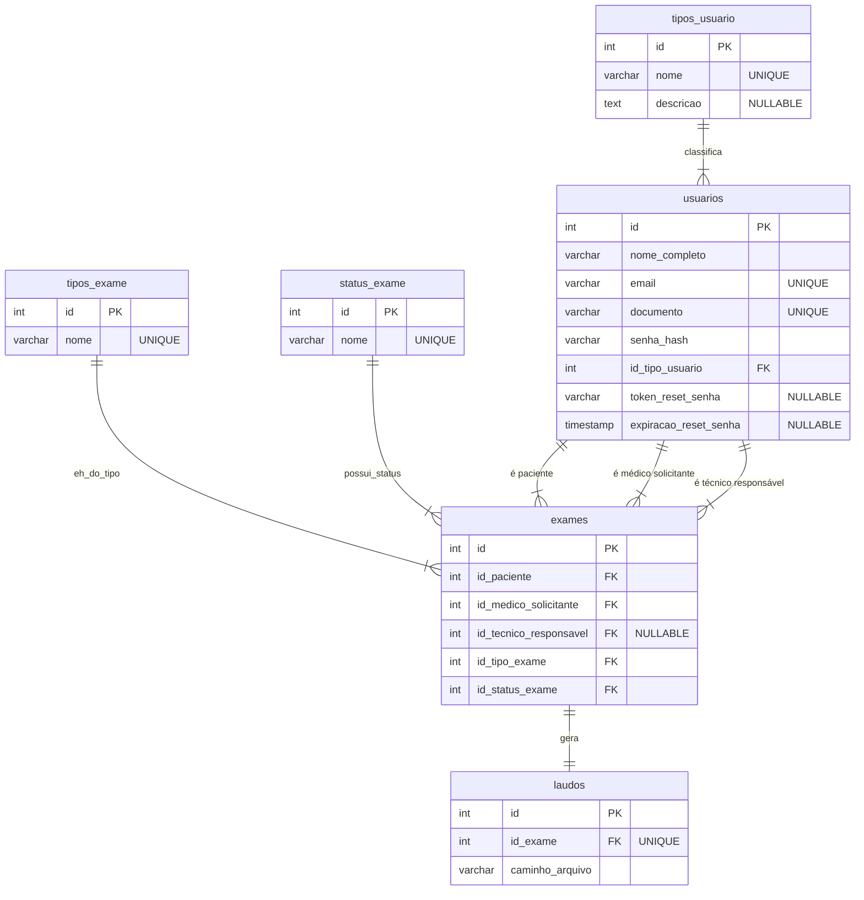

# API do Sistema de Gerenciamento de Exames Genéticos - UGEN

[](https://nodejs.org/)
[](https://www.postgresql.org/)
[](https://expressjs.com/)
[](https://www.docker.com/)

API RESTful para o gerenciamento do fluxo de exames genéticos da Unidade de Genética (UGEN) do GDF. A API controla o ciclo de vida completo, desde o registro de usuários e solicitação de exames até o upload de laudos.

## 📋 Índice

- [Funcionalidades](#-funcionalidades)
- [Tecnologias](#-tecnologias)
- [Estrutura do Projeto](#-estrutura-do-projeto)
- [Começando](#-começando)
- [API Endpoints](#-api-endpoints)
- [Modelo de Dados](#-modelo-de-dados)
- [Tipos de Usuário](#-tipos-de-usuário)
- [Status de Exame](#-status-de-exame)
- [Contribuição](#-contribuição)
- [Licença](#-licença)

## ✨ Funcionalidades

- **Gestão de Usuários**: Controle de acesso robusto baseado em papéis (Administrador, Técnico, Médico, Paciente).
- **Gerenciamento de Exames**: Fluxo completo desde a solicitação, passando pela análise, até a conclusão do exame.
- **Upload de Laudos**: Sistema de armazenamento persistente para os arquivos de resultado (PDFs).
- **Autenticação Segura**: Autenticação via JWT (JSON Web Tokens) e autorização granular por rotas.
- **Recuperação de Senha**: Fluxo seguro de redefinição de senha via e-mail.
- **Ambiente Containerizado**: Configuração pronta para desenvolvimento e produção com Docker e Docker Compose.

## 🛠️ Tecnologias

- **Backend**: Node.js, Express.js
- **Banco de Dados**: PostgreSQL
- **ORM**: Sequelize com Migrações
- **Autenticação**: JWT (jsonwebtoken)
- **Criptografia de Senhas**: bcryptjs
- **Upload de Arquivos**: Multer
- **Envio de E-mails**: Nodemailer
- **Containerização**: Docker, Docker Compose

## 📁 Estrutura do Projeto

```
api-citogenetica/
├── src/
│   ├── config/          # Configurações (banco, multer)
│   ├── controllers/     # Controladores (lógica das rotas)
│   ├── middlewares/     # Middlewares (autenticação, autorização)
│   ├── migrations/      # Migrações do banco de dados (schema)
│   ├── models/          # Modelos do Sequelize
│   ├── routes/          # Definição das rotas da API
│   ├── seeders/         # Dados iniciais para o banco
│   └── services/        # Serviços (lógica de negócio, ex: email)
├── uploads/             # (Gerado em tempo de execução) Arquivos de laudos
├── .dockerignore        # Arquivos ignorados pelo Docker
├── .env.example         # Exemplo de variáveis de ambiente
├── .sequelizerc         # Configuração de caminhos do Sequelize-CLI
├── docker-compose.yml   # Orquestração dos contêineres
├── Dockerfile           # Definição da imagem Docker da aplicação
├── package.json         # Dependências e scripts
└── server.js            # Ponto de entrada da aplicação
```

## 🚀 Começando

### Pré-requisitos

- [Node.js](https://nodejs.org/) (versão 18.x)
- [Docker](https://www.docker.com/) e [Docker Compose](https://docs.docker.com/compose/)

### Instalação com Docker (Recomendado)

Este é o método mais simples e rápido para iniciar o ambiente de desenvolvimento.

1.  **Clone o repositório**
    ```bash
    git clone https://github.com/seu-usuario/api-citogenetica.git
    cd api-citogenetica
    ```

2.  **Configure as variáveis de ambiente**
    Crie uma cópia do arquivo de exemplo e preencha com suas configurações.
    ```bash
    cp .env.example .env
    ```
    > **Importante:** Edite o arquivo `.env` gerado com suas credenciais.

3.  **Inicie os contêineres**
    Este comando irá construir a imagem da aplicação e iniciar os serviços do backend e do banco de dados em segundo plano.
    ```bash
    docker-compose up --build -d
    ```

4.  **Execute as Migrações e Seeds**
    Com os contêineres rodando, execute os seguintes comandos para configurar o banco de dados pela primeira vez:
    ```bash
    # Encontre o nome do seu contêiner da aplicação
    docker ps

    # Execute as migrações (substitua 'api-citogenetica-backend-1' pelo nome do seu contêiner)
    docker exec api-citogenetica-backend-1 npm run db:migrate

    # Popule o banco com dados iniciais (tipos de usuário, admin padrão, etc.)
    docker exec api-citogenetica-backend-1 npm run db:seed
    ```

O servidor estará disponível em `http://localhost:3000`.

## 🔌 API Endpoints

A seguir, uma lista dos principais endpoints da API. Todas as rotas protegidas exigem um token JWT no header `Authorization: Bearer <token>`.

### Autenticação (`/api/auth`)
| Método | Rota | Descrição | Acesso |
| :--- | :--- | :--- | :--- |
| `POST` | `/login` | Autentica um usuário e retorna um token JWT. | Público |
| `POST` | `/register/patient` | Registra um novo usuário com o papel de "Paciente". | Público |
| `POST` | `/request-password-reset`| Inicia o fluxo de recuperação de senha. | Público |

### Administrador (`/api/admin`)
| Método | Rota | Descrição | Acesso |
| :--- | :--- | :--- | :--- |
| `POST` | `/register/worker` | Registra um novo funcionário (Médico, Técnico, etc.). | **Admin** |

### Usuário (`/api/user`)
| Método | Rota | Descrição | Acesso |
| :--- | :--- | :--- | :--- |
| `PATCH`| `/update-password` | Atualiza a senha do usuário logado. | Autenticado (Qualquer papel) |

### Exames (`/api/exams`)
| Método | Rota | Descrição | Acesso |
| :--- | :--- | :--- | :--- |
| `POST` | `/` | Cria um novo registro de exame. | **Técnico** / **Admin** |
| `GET` | `/all` | Lista todos os exames do sistema. | **Técnico** / **Admin** |
| `GET` | `/doctor` | Lista os exames solicitados pelo médico logado. | **Médico** |
| `GET` | `/patient` | Lista os exames do paciente logado. | **Paciente** |

### Laudos (`/api/reports`)
| Método | Rota | Descrição | Acesso |
| :--- | :--- | :--- | :--- |
| `POST` | `/upload/:examId` | Anexa um arquivo de laudo a um exame existente. | **Técnico** |
| `PATCH`| `/:reportId` | Atualiza um arquivo de laudo existente. | **Técnico** |

## 💾 Modelo de Dados

### Diagrama Entidade-Relacionamento



## Modelo físico do banco de dados
O modelo físico do banco de dados é representado pelas tabelas e seus relacionamentos conforme descrito no diagrama ER acima.

```SQL
-- Habilita a extensão pgcrypto se for usar funções de criptografia nativas no futuro.
-- CREATE EXTENSION IF NOT EXISTS "pgcrypto";

-- =============================================================================
-- TABELAS DE APOIO (LOOKUP TABLES)
-- Estas tabelas fornecem valores consistentes para outras partes do sistema.
-- =============================================================================

-- Tabela para os tipos de usuário (funções/papéis)
CREATE TABLE tipos_usuario (
    id SERIAL PRIMARY KEY,
    nome VARCHAR(50) NOT NULL UNIQUE, -- Ex: 'Administrador', 'Técnico de Laboratório', 'Médico', 'Paciente'
    descricao TEXT
);
COMMENT ON TABLE tipos_usuario IS 'Define os papéis que os usuários podem ter no sistema.';

-- Tabela para os tipos de exame oferecidos
CREATE TABLE tipos_exame (
    id SERIAL PRIMARY KEY,
    nome VARCHAR(150) NOT NULL UNIQUE -- Ex: 'Cariótipo com Banda G', 'FISH para LMA', 'CGH-Array'
);
COMMENT ON TABLE tipos_exame IS 'Catálogo dos tipos de exames genéticos disponíveis.';

-- Tabela para os possíveis status de um exame
CREATE TABLE status_exame (
    id SERIAL PRIMARY KEY,
    nome VARCHAR(50) NOT NULL UNIQUE -- Ex: 'Solicitado', 'Aguardando Amostra', 'Em Análise', 'Laudo Disponível', 'Cancelado'
);
COMMENT ON TABLE status_exame IS 'Define o ciclo de vida e as etapas de um exame.';


-- =============================================================================
-- TABELAS PRINCIPAIS
-- =============================================================================

-- Tabela principal de usuários
CREATE TABLE usuarios (
    id SERIAL PRIMARY KEY,
    nome_completo VARCHAR(255) NOT NULL,
    email VARCHAR(255) NOT NULL UNIQUE,
    documento VARCHAR(11) NOT NULL UNIQUE,
    senha_hash VARCHAR(255) NOT NULL,
    id_tipo_usuario INTEGER NOT NULL,
    token_reset_senha VARCHAR(255),
    expiracao_reset_senha TIMESTAMPTZ, -- Armazena data, hora e fuso horário
    data_cadastro TIMESTAMPTZ NOT NULL DEFAULT (NOW() AT TIME ZONE 'America/Sao_Paulo'),
    data_atualizacao TIMESTAMPTZ NOT NULL DEFAULT (NOW() AT TIME ZONE 'America/Sao_Paulo'),

    CONSTRAINT fk_tipo_usuario
        FOREIGN KEY(id_tipo_usuario)
        REFERENCES tipos_usuario(id)
        ON DELETE RESTRICT -- Impede que um tipo de usuário em uso seja apagado.
);
COMMENT ON TABLE usuarios IS 'Armazena todos os usuários do sistema, de pacientes a administradores.';

-- Tabela principal de exames genéticos
CREATE TABLE exames (
    id SERIAL PRIMARY KEY,
    id_paciente INTEGER NOT NULL,
    id_medico_solicitante INTEGER NOT NULL,
    id_tecnico_responsavel INTEGER, -- Pode ser nulo inicialmente
    id_tipo_exame INTEGER NOT NULL,
    id_status_exame INTEGER NOT NULL,
    data_solicitacao TIMESTAMPTZ NOT NULL DEFAULT (NOW() AT TIME ZONE 'America/Sao_Paulo'),
    data_conclusao TIMESTAMPTZ,
    data_atualizacao TIMESTAMPTZ NOT NULL DEFAULT (NOW() AT TIME ZONE 'America/Sao_Paulo'),

    -- Chaves estrangeiras
    CONSTRAINT fk_paciente
        FOREIGN KEY(id_paciente) REFERENCES usuarios(id) ON DELETE RESTRICT,
    CONSTRAINT fk_medico_solicitante
        FOREIGN KEY(id_medico_solicitante) REFERENCES usuarios(id) ON DELETE RESTRICT,
    CONSTRAINT fk_tecnico_responsavel
        FOREIGN KEY(id_tecnico_responsavel) REFERENCES usuarios(id) ON DELETE SET NULL, -- Se o técnico for deletado, o campo fica nulo
    CONSTRAINT fk_tipo_exame
        FOREIGN KEY(id_tipo_exame) REFERENCES tipos_exame(id) ON DELETE RESTRICT,
    CONSTRAINT fk_status_exame
        FOREIGN KEY(id_status_exame) REFERENCES status_exame(id) ON DELETE RESTRICT
);
COMMENT ON TABLE exames IS 'Entidade central que armazena os registros de exames solicitados.';

-- Tabela dedicada para os laudos (resultados) dos exames
CREATE TABLE laudos (
    id SERIAL PRIMARY KEY,
    id_exame INTEGER NOT NULL UNIQUE, -- Relacionamento 1 para 1 com o exame
    caminho_arquivo VARCHAR(512) NOT NULL, -- Caminho no sistema de arquivos ou ID de um serviço de storage (S3, GCS, etc.)
    nome_arquivo VARCHAR(255),
    tipo_mime VARCHAR(100), -- Ex: 'application/pdf'
    tamanho_bytes BIGINT,
    data_upload TIMESTAMPTZ NOT NULL DEFAULT (NOW() AT TIME ZONE 'America/Sao_Paulo'),
    data_atualizacao TIMESTAMPTZ NOT NULL DEFAULT (NOW() AT TIME ZONE 'America/Sao_Paulo'),

    CONSTRAINT fk_exame
        FOREIGN KEY(id_exame) REFERENCES exames(id) ON DELETE CASCADE -- Se o exame for deletado, o laudo associado também é.
);
COMMENT ON TABLE laudos IS 'Armazena os metadados dos arquivos de resultado (laudos) dos exames.';


-- =============================================================================
-- ÍNDICES (INDEXES)
-- Para otimização de consultas frequentes.
-- =============================================================================

-- Índices nas chaves estrangeiras para acelerar os JOINS.
CREATE INDEX idx_usuarios_tipo_usuario ON usuarios(id_tipo_usuario);
CREATE INDEX idx_exames_paciente ON exames(id_paciente);
CREATE INDEX idx_exames_medico ON exames(id_medico_solicitante);
CREATE INDEX idx_exames_tecnico ON exames(id_tecnico_responsavel);
CREATE INDEX idx_exames_tipo_exame ON exames(id_tipo_exame);
CREATE INDEX idx_exames_status_exame ON exames(id_status_exame);

-- Índice no email para buscas rápidas de login.
CREATE INDEX idx_usuarios_email ON usuarios(email);
```


### Tipos de Usuário

- **admin**: Acesso completo ao sistema
- **tecnico**: Gerencia exames e laudos
- **medico**: Solicita exames e visualiza resultados
- **paciente**: Visualiza seus próprios exames

### Status de Exame

- **solicitado**: Exame foi solicitado
- **aguardando_amostra**: Aguardando coleta/recebimento da amostra
- **em_analise**: Exame sendo processado
- **laudo_disponivel**: Resultado pronto
- **cancelado**: Exame cancelado

## 🤝 Contribuição

1. Faça um fork do projeto
2. Crie uma branch para sua feature (`git checkout -b feature/AmazingFeature`)
3. Commit suas mudanças (`git commit -m 'Add some AmazingFeature'`)
4. Push para a branch (`git push origin feature/AmazingFeature`)
5. Abra um Pull Request

## 📄 Licença

Este projeto está sob a licença ISC. Veja o arquivo [LICENSE](LICENSE) para mais detalhes.

## 📞 Suporte

Para suporte técnico ou dúvidas sobre o sistema:

- **Email**: andreygoncalvesdev@gmail.com
- **Documentação**: [Wiki do Projeto](https://docs.google.com/document/d/1jhGv8T7RT1KSDAppYe04J1N4ay7vOwcv75wYHDjd5Hk/edit?tab=t.0)

---

**Desenvolvido para a UGEN - Unidade de Genética do GDF**